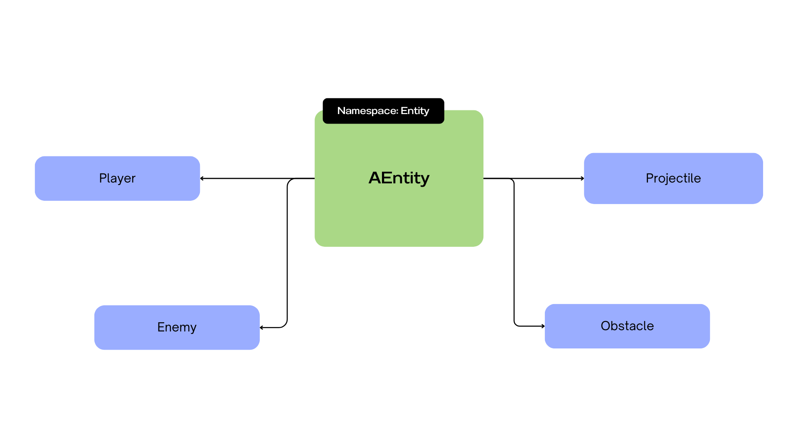

# Engine Readme
# RType Entity System Documentation

## Schema



## Introduction

The RType Entity System is designed to handle various game entities in the RType game. This documentation provides guidance on adding new entities or modifying existing ones.

## Entity Class Hierarchy

### `Entity::AEntity`

- Base class for all entities.
- Contains common attributes and methods shared among entities.

### `Entity::Player`

- Derived from `AEntity`.
- Represents the player entity in the game.

### `Entity::Enemy`

- Derived from `AEntity`.
- Represents an enemy entity in the game.
- Includes a `direction` enum for movement direction.

### `Entity::Projectile`

- Derived from `AEntity`.
- Represents a projectile entity in the game.
- Includes a boolean flag for projectile direction.

### `Entity::Obstacle`

- Derived from `AEntity`.
- Represents an obstacle entity in the game.

## Adding a New Entity

To add a new entity to the RType Entity System, follow these steps:

1. **Create a New Class:**
   - Create a new class derived from `Entity::AEntity` for your entity.
   - Name the class appropriately, considering the nature of the entity (e.g., `MyNewEntity`).

2. **Implement Required Methods:**
   - Override the following methods in your new entity class:

     ```cpp
     class MyNewEntity : public Entity::AEntity {
     public:
         MyNewEntity(unsigned int id, int x, int y, /* additional parameters if needed */);
         ~MyNewEntity();

         // Implement the update method for updating entity behavior.
         bool update(vector<Entity::AEntity *> entities) override;

         // Implement the getSourceType method to return the entity type.
         EntityType getSourceType() const override;
     };
     ```

     Ensure that the `update` method includes the specific behavior for your entity. This method is called during each game update.

3. **Modify `World` Class:**
   - In the `World` class (`World.hpp` and `World.cpp`), add a method to create an instance of your new entity.
     - Open `World.hpp` and add the declaration of your method, following the pattern of existing methods (e.g., `addPlayer`, `addEnemy`, etc.).

     ```cpp
     class World {
         // ...

     public:
         // Existing methods...

         // Add a method to create an instance of your new entity.
         Entity::MyNewEntity *addMyNewEntity(unsigned int id, int x, int y /*, additional parameters if needed */);
     };
     ```

     - Open `World.cpp` and implement the method to create and add an instance of your new entity.

     ```cpp
     Entity::MyNewEntity *World::addMyNewEntity(unsigned int id, int x, int y /*, additional parameters if needed */) {
         Entity::MyNewEntity *newEntity = new Entity::MyNewEntity(id, x, y /*, additional parameters if needed */);
         this->_entities.push_back(newEntity);
         return newEntity;
     }
     ```

4. **Update `updateWorld` Method:**
   - In the `World` class, update the `updateWorld` method to include your new entity type.
     - Check for updates in your new entity type and add it to the vector of entities to be processed.

     ```cpp
     vector<Entity::AEntity *> World::updateWorld() {
         vector<Entity::AEntity *> entitiesToShot;
         for (size_t i = 0; i < this->_entities.size(); i++)
             if (!this->_entities[i]->getIsDead())
                 if (this->_entities[i]->update(this->_entities))
                     entitiesToShot.push_back(this->_entities[i]);
         return entitiesToShot;
     }
     ```

Now, your new entity is integrated into the RType Entity System. Make sure to adjust parameters and behavior according to your entity's specific requirements.

## Class Dependencies

- **SFML Library:** The project uses SFML for graphics and input handling.
  Ensure that SFML is properly installed and linked in your project.

- **Vector2 and Keys Classes:** Dependencies for handling entity positions and key inputs.

## Example Usage

```cpp
// Example of adding a new Enemy entity
Entity::Enemy *newEnemy = world.addEnemy(1, 100, 200);
```

[Click on this link](README.md)