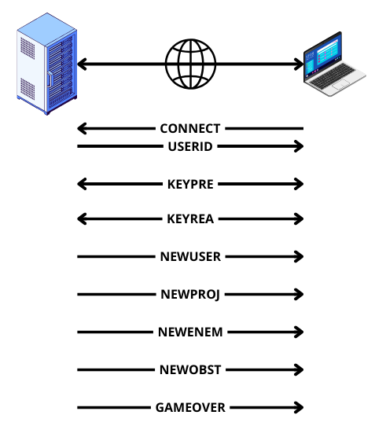

# Network Readme

# RFC - R-Type Game Protocol

## Schema

## Abstract

This document describes a protocol for communication between a client and server in the context of an R-Type game. The protocol facilitates the exchange of messages related to player connections, user updates, game events, and player input updates. The goal is to ensure a consistent and reliable communication mechanism between the game clients and the server.

## 1. Introduction

The R-Type Game Protocol is designed to support the interaction between clients and a server in an R-Type game. It specifies the format and semantics of messages exchanged between the two entities, including commands for player connection, user updates, and game events.

## 2. Message Format

All messages are formatted as text strings in a newline-delimited format. Each message consists of a command keyword followed by arguments separated by spaces. The order of arguments is defined by the specific command.

## 3. Client-to-Server Commands

### 3.1 `CONNECT`

- **Description**: Sent by a client upon connecting to the server.
- **Arguments**: None

### 3.2 `KEYPRE`

- **Description**: Sent by a client when a key is pressed.
- **Arguments**:
    - `id_player`: Player identifier.
    - `key`: Key identifier (0 to 4 for Z, Q, S, D, and Space, respectively).

### 3.3 `KEYREA`

- **Description**: Sent by a client when a key is released.
- **Arguments**:
    - `id_player`: Player identifier.
    - `key`: Key identifier (0 to 4 for Z, Q, S, D, and Space, respectively).

## 4. Server-to-Client Commands

### 4.1 `USERID`

- **Description**: Sent by the server in response to a `CONNECT` command.
- **Arguments**:
    - `id_user`: User identifier assigned by the server.

### 4.2 `NEWUSER`

- **Description**: Sent by the server when a new user connects.
- **Arguments**:
    - `id`: User identifier.
    - `posX`: X-coordinate of the user's position.
    - `posY`: Y-coordinate of the user's position.

### 4.3 `GAMEOVER`

- **Description**: Sent by the server to all clients when the game is over.
- **Arguments**: None

### 4.4 `NEWPROJ`

- **Description**: Sent by the server when a new projectile is added to the game.
- **Arguments**:
    - `id`: Entity identifier.
    - `posX`: X-coordinate of the entity's position.
    - `posY`: Y-coordinate of the entity's position.
    - `type`: Projectile's type (projectile is from player or enemy).

### 4.5 `NEWENEM`

- **Description**: Sent by the server when a new enemy is added to the game.
- **Arguments**:
    - `id`: Entity identifier.
    - `posX`: X-coordinate of the entity's position.
    - `posY`: Y-coordinate of the entity's position.
    - `dir`: Direction of the entity

### 4.6 `NEWOBST`

- **Description**: Sent by the server when a new obstacle is added to the game.
- **Arguments**:
    - `id`: Entity identifier.
    - `posX`: X-coordinate of the entity's position.
    - `posY`: Y-coordinate of the entity's position.

### 4.7 `KEYPRE`

- **Description**: Sent by the server to update the player's state when he starts pressing a key.
- **Arguments**:
    - `id_player`: Player identifier.
    - `key`: Key identifier (0 to 4 for Z, Q, S, D, and Space, respectively).

### 4.8 `KEYREA`

- **Description**: Sent by the server to update the player's state when he releases a key.
- **Arguments**:
    - `id_player`: Player identifier.
    - `key`: Key identifier (0 to 4 for Z, Q, S, D, and Space, respectively).

## 5. Conclusion

This RFC defines a protocol for communication between R-Type game clients and servers, ensuring a standardized and extensible approach for handling player connections, user updates, and game events. Implementations should adhere to this protocol to ensure interoperability and consistent gameplay experiences.

# Main Readme

[Click on this link](README.md)